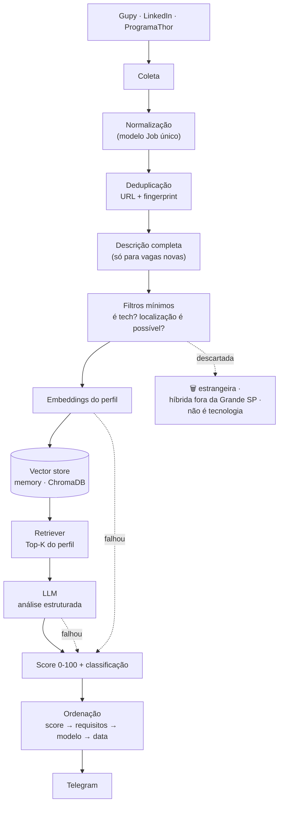

# 🤖 JobMatch AI — recomendação inteligente de vagas no Telegram

[](https://www.python.org/)
[]()
[]()
[]()
[](https://opensource.org/licenses/MIT)

Coleta vagas de tecnologia em três fontes, lê os **requisitos reais** de cada
uma, compara com um perfil profissional estruturado usando RAG + LLM, e envia
as melhores oportunidades no Telegram — ordenadas por aderência.

---

## 📖 O que mudou

O projeto nasceu como um fork do bot de vagas da Gupy de
[Lucas Nunes](https://github.com/lucasnunestrabalho99-sudo/telegram-vagas-gupy-bot).
A versão anterior respondia a esta pergunta:

> "O título desta vaga contém alguma das minhas tecnologias?"

O JobMatch AI responde a outra:

> "Esta vaga vale a pena eu analisar, considerando meus requisitos técnicos,
> conhecimentos e experiências reais?"

| | Antes | Agora |
|---|---|---|
| **Matching** | contagem de substring no título | requisitos da descrição, ponderados por nível de evidência + similaridade semântica + LLM |
| **Senioridade** | vaga "Sênior" era **descartada** | informação contextual, peso zero no score |
| **Stack fora do perfil** | `.NET`/`Kafka` no título **descartava** a vaga | vira um *gap* nomeado na mensagem |
| **Localização** | `"sp" in local` (casava com "Ja**sp**ion") | por token, com regra própria para remoto / híbrido / presencial |
| **Modelos de trabalho** | só remoto e SP | remoto, híbrido e presencial — preferência de ranking, não filtro |
| **Cargos buscados** | front end, full stack | + backend, software engineer, AI engineer |
| **Deduplicação** | URL exata | URL + *fingerprint* (empresa + cargo normalizado + cidade) |
| **Envio** | em streaming, sem ordem | tudo coletado, pontuado e **ordenado** antes de enviar |
| **Testes** | nenhum | 169 testes cobrindo as regras críticas |

Efeito medido numa execução real: **140 vagas analisadas** contra as ~4 buscas
com filtros eliminatórios da versão anterior.

---

## 🏗️ Arquitetura



As setas pontilhadas são o caminho de resiliência: **falha de IA nunca impede
o envio**. Sem RAG, o score é heurístico; sem LLM, o score semântico é usado;
sem ChromaDB, o store cai para memória.

### Estrutura

```
main.py                      # entrypoint fino
profile.yaml                 # ⭐ perfil profissional (única fonte de verdade)
src/jobmatch/
  config/settings.py         # .env → Settings
  domain/
    job.py                   # Job, WorkModel, seções da descrição, fingerprint
    profile.py               # Profile, Skill, níveis de evidência
    match.py                 # MatchResult, faixas de classificação
    text.py                  # normalização (deaccent, tokens, limite de palavra)
  collectors/                # gupy · linkedin · programathor
  filters/eligibility.py     # ÚNICO ponto que descarta vagas
  matching/                  # heuristic.py · vocabulary.py (gaps)
  rag/                       # embeddings · vector_store · chunker · retriever
  ai/                        # llm.py (providers) · analyzer.py (prompt + validação)
  notifications/telegram.py
  persistence/sqlite.py
  pipeline.py                # orquestração
tests/                       # 169 testes
```

**Divisão de responsabilidades entre os bancos (§14):** o SQLite continua dono
do histórico, das URLs enviadas e da deduplicação; o banco vetorial cuida só de
embeddings e recuperação semântica. Um nunca substitui o outro.

---

## 🎯 Como funciona o matching

A pergunta que o sistema faz **não** é "tem experiência profissional? sim/não".
É **"qual é a evidência de competência?"**.

Cada skill no `profile.yaml` lista as *provas* de que a competência existe.
Experiência profissional continua sendo a evidência mais forte — e o rótulo
dela nunca é aplicado a outra coisa — mas projeto, hands-on, curso e estudo
valem crédito real em vez de quase zero.

| Evidência | Peso | Significado |
|---|---|---|
| `professional` | 1.00 | usou em produção, remunerado, vínculo formal |
| `freelance` | 0.95 | usou em produção, remunerado, autônomo |
| `production_project` | 0.85 | projeto próprio rodando de verdade |
| `project` | 0.75 | projeto próprio / portfólio publicado |
| `academic_project` | 0.62 | projeto acadêmico |
| `knowledge` / `hands_on` | 0.60 | sabe aplicar / POC, laboratório |
| `certification` | 0.55 | certificação |
| `course` | 0.48 | curso ou bootcamp concluído |
| `study` | 0.40 | estudando agora |
| `interest` | 0.20 | acompanha, sem prática |

Uma skill pode acumular evidências. A mais forte manda; as demais somam um
bônus limitado a **+0.15**, para que acumular provas fracas jamais simule
experiência profissional:

```
só estudo                    → 0.40
estudo + projeto + hands-on  → 0.90
experiência profissional     → 1.00
```

É isso que resolve o problema central: uma vaga de AI Engineer pedindo RAG,
LLMs e embeddings deixa de ser "baixa compatibilidade" só porque essas
tecnologias não apareceram num emprego formal. Elas foram **implementadas neste
próprio repositório**, e isso é evidência de projeto — reconhecida como tal,
nunca apresentada como emprego.

### Taxonomia e competências transferíveis

`skill_groups` no `profile.yaml` agrupa tecnologias relacionadas, incluindo de
propósito as que o perfil **não** tem. É o que transforma ausência total em
compatibilidade parcial:

| A vaga pede | O perfil tem | Resultado |
|---|---|---|
| Pinecone | ChromaDB, embeddings, RAG | 🔄 transferível (grupo `rag`) |
| Zapier | Make, n8n, automação | 🔄 transferível (grupo `automation`) |
| FastAPI | Python, Django | 🔄 transferível (grupo `python_backend`) |
| Kubernetes | Docker | 🔄 transferível, mas fraco |

Cada grupo tem seu próprio `transfer_factor`, porque as proximidades não são
iguais: ChromaDB→Pinecone vale `0.75`; Docker→Kubernetes vale `0.30`. Sem essa
calibração, conhecer Docker inflaria uma vaga de SRE.

### Composição do score

```
core 0.50 (requisitos obrigatórios, ponderados por evidência)
nice 0.12 (diferenciais)
role 0.18 (aderência de cargo)
semantic 0.20 (similaridade perfil × vaga)
+ bônus de modelo de trabalho (remoto 4 · híbrido ~2,7 · presencial ~1,3)
+ bônus de competência emergente (até 4, só com cobertura real)
```

A cobertura medida é **encolhida na direção de um prior** com peso equivalente
a 2 requisitos. Uma descrição que lista 2 tecnologias diz muito menos sobre a
vaga do que uma que lista 10 — sem isso, "100% de aderência" sobre 2 requisitos
valeria o mesmo que sobre 10, e descrição magra viraria score inflado.

O bônus de modelo é sempre não-negativo: presencial ganha menos, nunca perde
pontos. Senioridade não entra em nenhum componente.

| Score | Classificação |
|---|---|
| 90–100 | 🔥 Excelente compatibilidade |
| 80–89 | 🟢 Alta compatibilidade |
| 70–79 | 🟢 Boa compatibilidade |
| 60–69 | 🟡 Compatibilidade razoável |
| 50–59 | 🟡 Possível oportunidade |
| < 50 | ⚪ Baixa compatibilidade |

> Nesta versão o score **ordena, prioriza e explica** — não descarta.

### Calibração

`python tools/calibrate.py` coleta vagas reais e compara o scoring atual com o
anterior, listando ganhos, quedas e auditoria de falso positivo. Foi assim que
se descobriu que o alias `less` (de LESS/CSS) casava com o rodapé
*"show more show less"* do LinkedIn em **120 de 185** descrições.

### Regras de elegibilidade (o único ponto que descarta)

```
REMOTO      → Brasil inteiro
HÍBRIDO     → São Paulo / Grande SP
PRESENCIAL  → São Paulo / Grande SP
Localização ausente ou ambígua → MANTÉM, marcada como "não confirmada"
```

Só três coisas descartam uma vaga: não ser de tecnologia, ser estrangeira, ou
ser híbrida/presencial numa cidade identificável fora da Grande SP.

---

## 🧠 Como funciona o RAG

O ChromaDB não está aqui como enfeite: ele resolve um problema concreto —
*dada esta vaga, quais partes do meu perfil são relevantes para comparar?*

**Indexação.** O perfil é dividido em chunks **semânticos**, não em fatias de N
caracteres: um chunk por experiência, um por projeto, um por estudo, e um por
família de skill. Cada chunk carrega metadata (`type`, `title`, `technologies`,
`experience_level`), e é o `experience_level` que impede o LLM de transformar
*"estudei Java"* em *"3 anos de experiência com Java"*.

**Recuperação.** A descrição da vaga vira embedding, o retriever traz o Top-K, e
só esses chunks vão para o prompt — menos token, menos custo, menos alucinação.

**Decisão de infraestrutura (§23):** o store padrão é `memory`, e o índice é
**reconstruído a cada execução**. São ~25 chunks: o custo é desprezível, e isso
elimina qualquer dependência de estado persistente entre runs do GitHub
Actions. Instalar `chromadb` no CI significaria ~250 MB (com `onnxruntime`) por
execução para indexar 25 documentos. `ChromaVectorStore` está implementado
atrás da mesma interface e liga com `VECTOR_STORE=chroma` quando fizer sentido
— trocar por pgvector, Qdrant ou Pinecone é adicionar uma classe em
`rag/vector_store.py`, nada mais.

---

## 👤 Configurando o perfil

Todo o perfil vive em [`profile.yaml`](profile.yaml) — nada hardcoded no código.

```yaml
skills:
  - name: RAG
    family: ai
    aliases: [rag, retrieval augmented generation]
    evidence:
      - type: production_project
        note: pipeline de recuperação sobre o perfil no JobMatch AI
        source: proj_jobmatch_ai
      - type: study
      - type: course

  - name: Make
    aliases_only: true          # o nome é palavra comum do inglês
    aliases: [make.com, integromat]
    evidence:
      - type: course
      - type: hands_on
```

`note` é o que sustenta a afirmação — é esse texto que vai para o chunk do RAG
e impede o LLM de inventar contexto. `aliases_only` evita que um nome ambíguo
("Make", "Go") case com texto comum da descrição.

> ⚠️ **`experiences` vem vazio de propósito.** Várias skills estão marcadas como
> `professional`, mas o histórico de empregos não está detalhado. Enquanto essa
> lista estiver vazia, o pipeline reconhece a competência **e** instrui o LLM a
> não citar empresas, cargos ou tempo de experiência — porque esses dados não
> existem no perfil e não podem ser inventados. **Preencher `experiences` é a
> mudança que mais melhora a qualidade dos scores.**

## ⚙️ Variáveis de ambiente

Copie [`.env.example`](.env.example) para `.env`. Nenhum segredo fica no código.

| Variável | Padrão | Descrição |
|---|---|---|
| `TELEGRAM_TOKEN` | — | **Obrigatório.** Token do [@BotFather](https://t.me/botfather) |
| `CHAT_ID_GRUPO` | — | **Obrigatório.** ID do grupo/canal |
| `MAX_AGE_DAYS` | `3` | Idade máxima da vaga |
| `MAX_JOBS_PER_RUN` | `40` | Teto de mensagens por execução |
| `EMBEDDING_PROVIDER` | `hashing` | `hashing` (local) · `openai` · `gemini` |
| `VECTOR_STORE` | `memory` | `memory` · `chroma` |
| `LLM_PROVIDER` | `none` | `none` · `anthropic` · `openai` · `gemini` |
| `LLM_MODEL` | por provider | `claude-opus-5` · `gpt-4o-mini` · `gemini-2.0-flash` |
| `LLM_MAX_JOBS` | `15` | Teto de chamadas por execução |
| `LLM_MIN_SCORE` | `45` | Piso de pré-score para gastar uma chamada |
| `ANTHROPIC_API_KEY` / `OPENAI_API_KEY` / `GEMINI_API_KEY` | — | Só a do provider em uso |
| `DRY_RUN` | — | `1` imprime no terminal em vez de enviar |

**Sobre custo (§21):** o LLM é a etapa cara e roda por último, só nas
`LLM_MAX_JOBS` melhores vagas acima de `LLM_MIN_SCORE`. As descrições completas
só são buscadas para vagas que passaram na deduplicação. Com Claude, o prompt
de sistema usa *prompt caching* — a partir da segunda vaga da execução ele é
lido a ~10% do preço de entrada. Para o menor custo possível, use
`LLM_MODEL=claude-haiku-4-5`.

---

## 🚀 Executando

```bash
git clone https://github.com/pmarsiglia93/telegram-vagas-gupy-bot.git
cd telegram-vagas-gupy-bot

pip install -r requirements.txt        # requests, beautifulsoup4, PyYAML
pip install -r requirements-ai.txt     # opcional: SDK do LLM

cp .env.example .env                   # e preencha TELEGRAM_TOKEN / CHAT_ID_GRUPO

python main.py                         # execução normal
DRY_RUN=1 python main.py               # imprime sem enviar
```

Sem nenhuma chave de IA o bot roda normalmente, com score heurístico +
embedding local.

### Testes

```bash
pip install -r requirements-dev.txt
python -m pytest tests/ -q
```

Cobrem as regras que não podem regredir: senioridade não elimina nem penaliza,
localização por modelo de trabalho, matching por descrição, estudo não vira
ponto forte, validação da saída do LLM, deduplicação entre fontes, ordenação e
limite de tamanho da mensagem.

### GitHub Actions

Em **Settings → Secrets and variables → Actions**:

| Tipo | Nome | Obrigatório |
|---|---|---|
| Secret | `TELEGRAM_TOKEN` | ✅ |
| Secret | `CHAT_ID_GRUPO` | ✅ |
| Secret | `ANTHROPIC_API_KEY` (ou `OPENAI_API_KEY` / `GEMINI_API_KEY`) | opcional |
| Variable | `LLM_PROVIDER`, `LLM_MODEL`, `EMBEDDING_PROVIDER` | opcional |

O workflow roda os testes antes do bot, e o SDK do LLM só é instalado quando há
`LLM_PROVIDER` configurado. Horários: **seg–sex 9h/12h/15h/18h, sáb–dom 11h/17h**
(BRT). `workflow_dispatch` aceita um checkbox de dry-run.

> O agendamento do GitHub Actions é *best-effort*. Com 7 execuções/dia este
> repositório viu o atraso crescer de 14 min para 5 h em dois dias, até os
> horários passarem a ser descartados. 4×/dia mantém o agendador confiável —
> e cada execução agora analisa ~160 vagas, não algumas dezenas.

---

## 📱 Exemplo de alerta

```
🔥 MATCH 91%

💼 Software Engineer
🏢 Empresa X

📍 Remoto · Brasil
🎯 Excelente compatibilidade
🧩 Full Stack
📅 26/08/2026 às 09:15

✅ Pontos fortes
• React
• TypeScript
• REST APIs
• PostgreSQL

🟡 Compatibilidade parcial
• Vue (via React)

📚 Conhecimento relacionado
• RAG (em estudo)

⚠️ Gaps
• AWS
• Kubernetes

💡 Análise
Forte aderência aos requisitos centrais de frontend e integração
de APIs. Cloud aparece como diferencial, não como bloqueio.

🟣 Ver vaga na Gupy
```

A mensagem é truncada com segurança no limite de 4096 caracteres do Telegram, e
todo texto vindo das fontes é escapado como HTML.

---

## 🙏 Créditos

Projeto originalmente desenvolvido por
**[Lucas Nunes](https://github.com/lucasnunestrabalho99-sudo)** — obrigado por
tornar o código público e inspirar esta evolução.

---

**Desenvolvido com ☕ por Paulo Marsiglia** · [LinkedIn](https://linkedin.com/in/paulomarsiglia) · [GitHub](https://github.com/pmarsiglia93)
